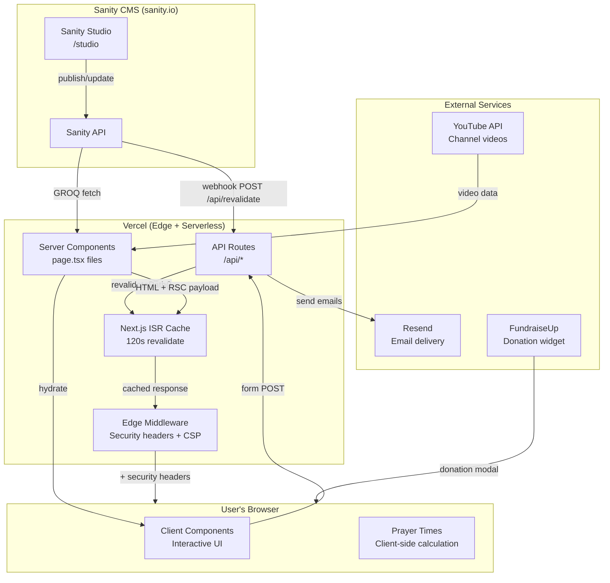
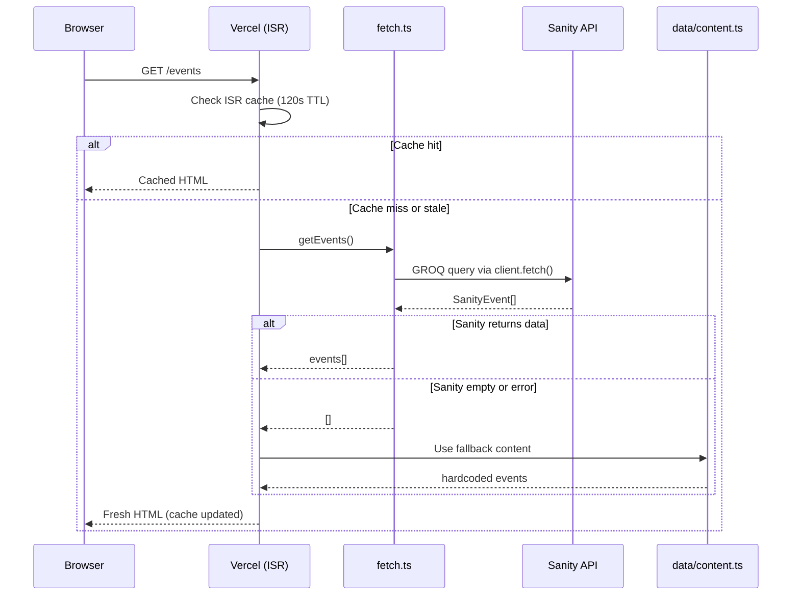
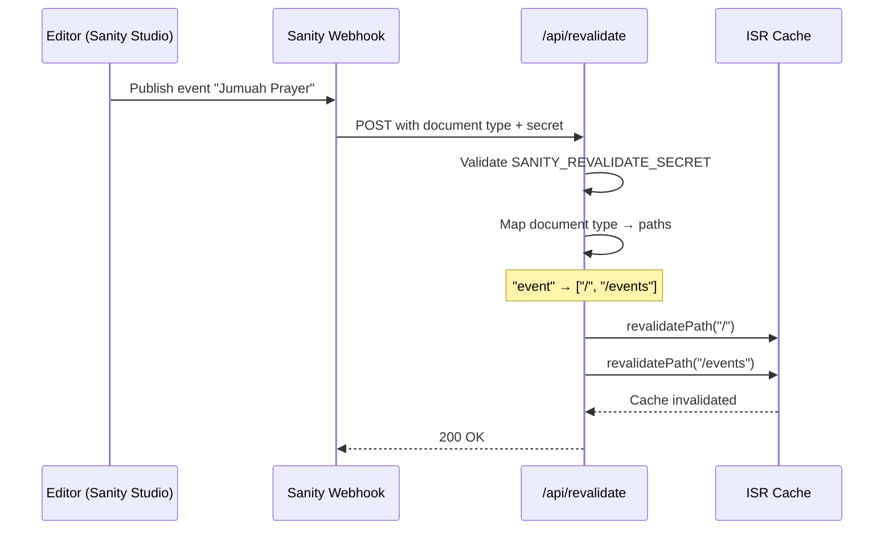
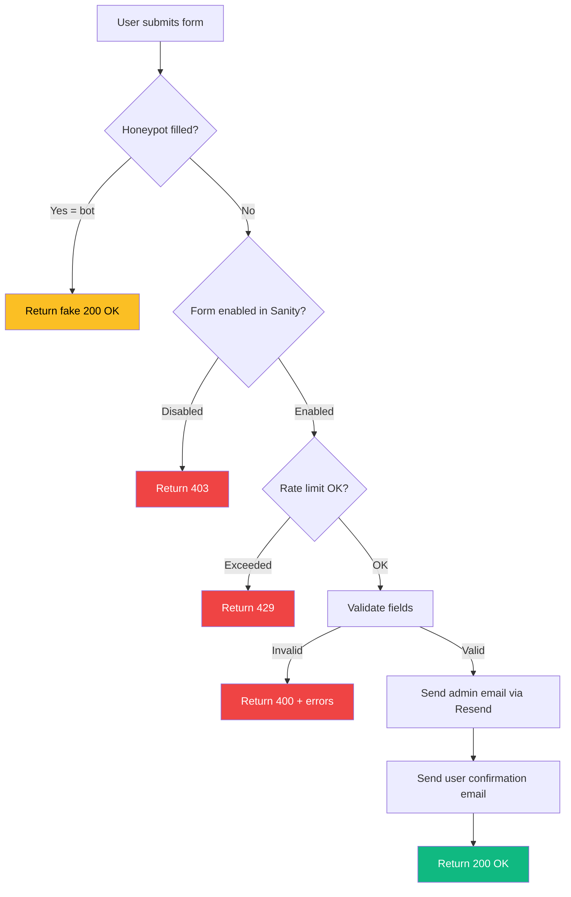
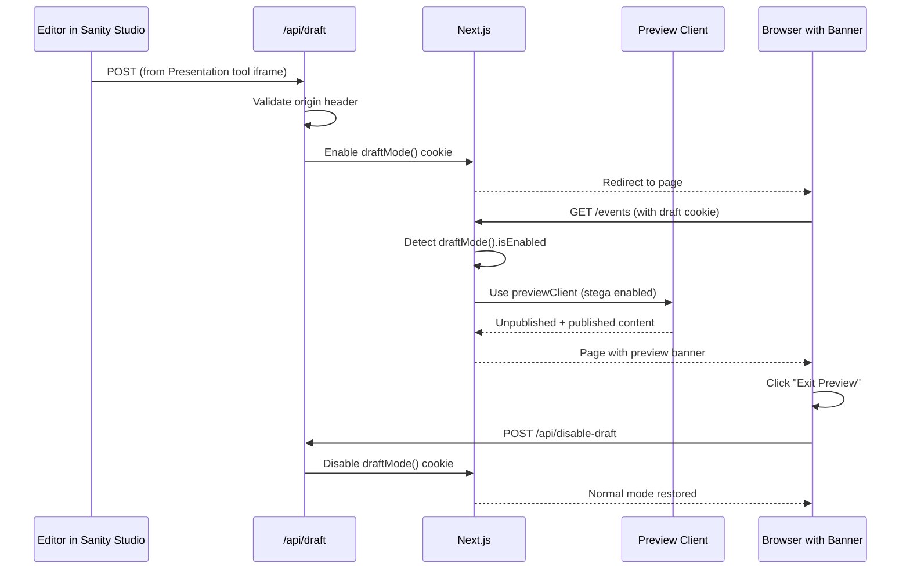
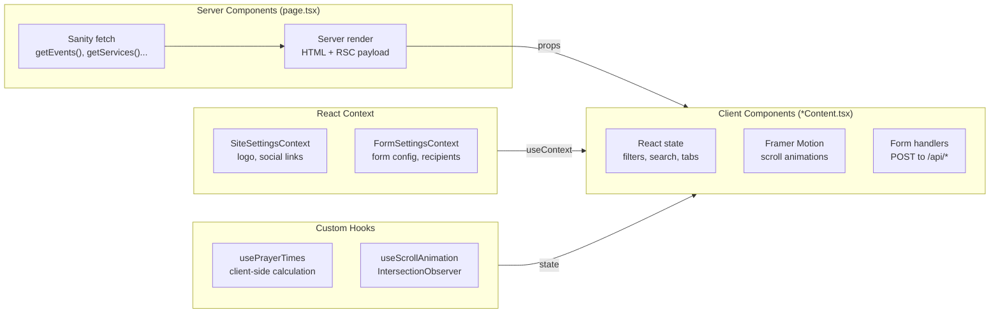

# Architecture

Visual overview of how data flows through the AIC website — from Sanity CMS to the browser.

---

## System Overview



---

## Data Fetching Pipeline

Every page follows the same pattern: **Sanity first, fallback if empty**.



---

## On-Demand Revalidation

When content is published in Sanity, pages update instantly — no need to wait for the 120s TTL.



**Document type → path mapping:**

| Document Type | Revalidated Paths |
|---------------|-------------------|
| `event` | `/`, `/events` |
| `announcement` | `/`, `/announcements` |
| `service` | `/`, `/services` |
| `teamMember` | `/`, `/imams` |
| `galleryImage` | `/`, `/media` |
| `faq` | `/` |
| `siteSettings` | `/` (all pages via layout) |
| `prayerSettings` | `/worshippers` |
| `donationCampaign` | `/`, `/donate` |

---

## Form Submission Pipeline

All four form endpoints (`/api/contact`, `/api/event-inquiry`, `/api/service-inquiry`, `/api/subscribe`) follow the same pipeline.



**Security layers (in order):**
1. **Honeypot** — invisible field traps bots, returns fake success
2. **Form toggle** — forms can be disabled from Sanity dashboard
3. **Rate limit** — 5 requests per hour per IP (in-memory Map)
4. **Validation** — required fields, email format, max lengths
5. **CSP** — Content Security Policy set by Edge middleware

---

## Draft Mode (Preview)

Editors can preview unpublished Sanity content before it goes live.



---

## Client Architecture



**Server vs Client split:**
- **Server Components** (`page.tsx`) — fetch data from Sanity, generate static HTML
- **Client Components** (`*Content.tsx`) — handle interactivity (filters, forms, animations)
- **Contexts** — provide site-wide settings without prop drilling
- **Hooks** — encapsulate reusable client-side logic

---

## File Organisation

```
src/
├── app/                    # Routes (Next.js App Router)
│   ├── page.tsx            # Homepage (server component)
│   ├── events/
│   │   ├── page.tsx        # Server: fetch events
│   │   └── EventsContent   # Client: filters, search
│   └── api/                # API routes (serverless)
├── components/
│   ├── ui/                 # Base components (Button, Card, Input)
│   ├── sections/           # Homepage sections (16 components)
│   ├── layout/             # Header + Footer
│   └── animations/         # Framer Motion wrappers
├── contexts/               # React Context providers
├── hooks/                  # Custom React hooks
├── lib/                    # Pure utilities (no React)
├── sanity/
│   ├── schemas/            # CMS content type definitions
│   └── lib/                # Client, queries, fetch functions
├── data/                   # Hardcoded fallback content
├── types/                  # TypeScript interfaces
└── test/                   # Test utilities and setup
```

---

## Environment Variables

### Public (available in browser)
| Variable | Purpose |
|----------|---------|
| `NEXT_PUBLIC_SANITY_PROJECT_ID` | Sanity project identifier |
| `NEXT_PUBLIC_SANITY_DATASET` | Sanity dataset name (`production`) |
| `NEXT_PUBLIC_SANITY_API_VERSION` | Sanity API version (`2024-01-01`) |
| `NEXT_PUBLIC_BASE_URL` | Site URL (for CSP, preview links) |

### Secret (server-only)
| Variable | Purpose |
|----------|---------|
| `SANITY_API_READ_TOKEN` | Sanity read token (draft mode) |
| `SANITY_PREVIEW_SECRET` | Shared secret for draft mode entry |
| `SANITY_REVALIDATE_SECRET` | Shared secret for ISR webhook |
| `RESEND_API_KEY` | Resend email API key |
| `RESEND_FROM_EMAIL` | Verified sender email address |
| `RESEND_AUDIENCE_ID` | Resend audience for newsletter |
| `YOUTUBE_API_KEY` | YouTube Data API v3 key |
| `YOUTUBE_CHANNEL_ID` | AIC YouTube channel ID |
| `CONTACT_FORM_TO_EMAIL` | Contact form recipient |
| `FORM_TO_EMAIL` | General form recipient |
| `SERVICE_INQUIRY_TO_EMAIL` | Service inquiry recipient |
| `SUBSCRIBE_TO_EMAIL` | Newsletter notification recipient |

---

## Key Design Decisions

### Why ISR instead of Sanity CDN?
Next.js ISR is the **only** caching layer (`useCdn: false` on all Sanity clients). This gives us:
- On-demand revalidation via webhook (instant updates)
- Consistent cache behaviour (one TTL to reason about)
- No stale CDN edge cache to debug

### Why stega disabled on production client?
Sanity's stega feature injects invisible zero-width characters into strings for Visual Editing. This breaks client-side string comparisons (`===`, `.includes()`) because `"Education"` becomes 1,241 characters. Stega is only enabled on the `previewClient` used during draft mode.

### Why in-memory rate limiting?
Serverless functions on Vercel don't share memory across instances. The current in-memory Map rate limiter works for light traffic but won't prevent distributed attacks. For higher traffic, consider upgrading to Redis (Upstash) or Vercel KV.

### Why fallback content?
If Sanity is unreachable or returns empty data, pages still render with sensible defaults from `src/data/content.ts`. This prevents blank pages during CMS outages.
